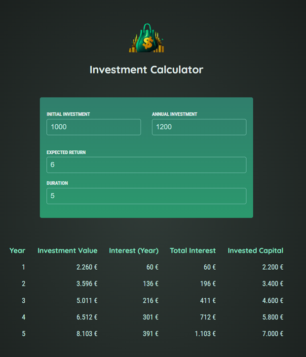

# 💰 Investment Calculator

A simple yet powerful **Investment Calculator** built with **React** and **Vite**.  
It allows users to dynamically explore how their investments grow over time — instantly updating the calculation table as you type.

<p align="left">
  
</p>

---

## 🧭 Overview

This app provides a clear, responsive visualization of how an investment evolves based on user inputs.  
The calculations update live via React state management without any need to refresh the page.


---

## ✨ Features

- ⚛️ **React + Vite** for fast development and hot reloading  
- 🧮 **Live calculation** – every change in user input updates the table immediately  
- 💸 Input fields for:
  - `Initial Investment` (default: **1000 USD**)  
  - `Annual Investment` (default: **1200 USD**)  
  - `Expected Return` (default: **6%**)  
  - `Duration` (default: **10 years**)  
- 📊 **Auto-generated investment table** showing:
  - Investment value at the end of each year  
  - Interest earned per year  
  - Total interest accumulated  
  - Total invested capital  
- 📱 **Responsive layout** – optimized for all screen sizes  
- 🎨 Clean and modern UI with CSS gradients and color coding  

---

## 🧠 How It Works

1. The app uses a central state object managed by React’s `useState`.
2. When the user edits any input field, a handler updates the corresponding value.
3. This triggers a recalculation of all annual investment results via the function `calculateInvestmentResults()`.
4. The results are rendered in a formatted table immediately.

---

## 🛠️ Tech Stack

- **React 19**
- **Vite 5**
- **JavaScript (ES2023)**
- **CSS3**
- **Intl.NumberFormat API** for currency formatting

---

## 🚀 Getting Started

1) **Clone and install**
```bash
git clone https://github.com/yourusername/investment-calculator.git
cd investment-calculator
npm install
```
2) **Run the dev server**
```bash
npm run dev
```

3) **Open in your browser**
```bash
Navigate to local host.
```
---

## 🧾 License

This project is licensed under the `MIT License`.
Feel free to use, modify, and distribute it.

---